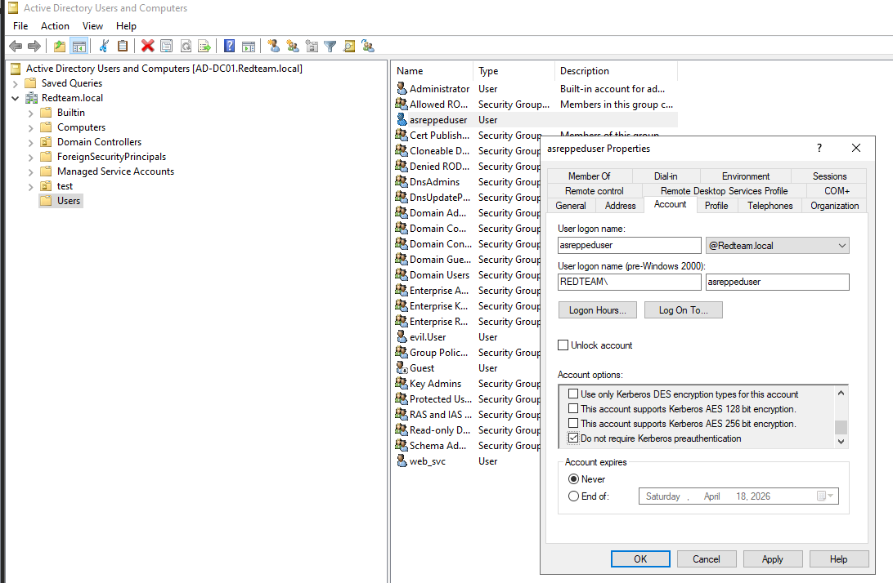

AS-REP Roasting (T1558.004) targets Active Directory accounts that have Kerberos Pre-Authentication disabled. When pre-authentication is disabled, the Domain Controller will respond to TGT requests without verifying the requester's identity first. The response contains data encrypted with the target account's password hash, which can be captured and cracked offline to recover plaintext credentials. Accounts using RC4 encryption are significantly easier to crack.


***Lab Setup***

GUI: `Win + r` -> `dsa.msc` Create a new user in the desired FQDN.
`Right click the user -> Properties -> Account Tab` under `Account Options` check `Do Not Require Kerberos preauthentication`


CLI: Run Powershell as administrator. 

Creating the user: `New-ADUser -Name "asreppeduser" -SamAccountName "asreppeduser" -AccountPassword (ConvertTo-SecureString "Password123" -AsPlainText -Force) -Enabled $true -PasswordNeverExpires $true`

Disable Pre-Auth:`Set-ADAccountControl -Identity "asreppeduser" -DoesNotRequirePreAuth $true`

Verify: `Get-ADUser -Identity "asreppeduser" -Properties DoesNotRequirePreAuth | Select-Object SamAccountName, DoesNotRequirePreAuth`


***Attack***

From Linux: `impacket-GetNPUsers -dc-ip $IP $FQDN/asreppeduser -no-pass -request`
![[Active Directory/AS-REP Roasting/kali linux impacket.png]]

From Windows: `.\Rubeus.exe asreproast` 
![[Powershell Rubeus asreproast.png]]


***Detection***

Custom Wazuh Rule:
```xml
<rule id="100011" level="12">
 <if_sid>60103</if_sid>
 <field name="win.system.eventID">^4768$</field>
 <field name="win.eventdata.ticketEncryptionType">^0x12$</field> 
 <field name="win.eventdata.preAuthType">^0$</field>
  <description>AS-REP Roasting detected - TGT requested without pre-authentication</description>
   <mitre>
   <id>T1558.004</id>
   </mitre>
   </rule>
```
![[Active Directory/AS-REP Roasting/Wazuh.png]]

| Field                                | Value                   | Meaning               |
| ------------------------------------ | ----------------------- | --------------------- |
| `if_sid 60103`                       | Windows Security Events | Parent rule           |
| `win.system.eventID`                 | 4768                    | Kerberos TGT Request  |
| `win.eventdata.ticketEncryptionType` | 0x12                    | AES256 encryption     |
| `win.eventdata.preAuthType`          | 0                       | Pre-auth was not used |
| `level 12`                           | High Severity           |                       |
| `T1558.004`                          | MITRE ATT&CK ID         | AS-REP Roasting       |

***Remediations***

| Enable Pre-Authentication | Audit all accounts and ensure pre-auth is enabled there is rarely a legitimate reason to disable it                                                      |
| ------------------------- | -------------------------------------------------------------------------------------------------------------------------------------------------------- |
| Strong Passwords          | Complex passwords of 25+ characters make offline cracking computationally infeasible                                                                     |
| Regular Auditing          | Regularly run `Get-ADUser -Filter * -Properties DoesNotRequirePreAuth \| Select-Object SamAccountName,DoesNotRequirePreAuth` to find vulnerable accounts |
| Least Privilege           | Ensure minimum privileges where-ever possible.                                                                                                           |
