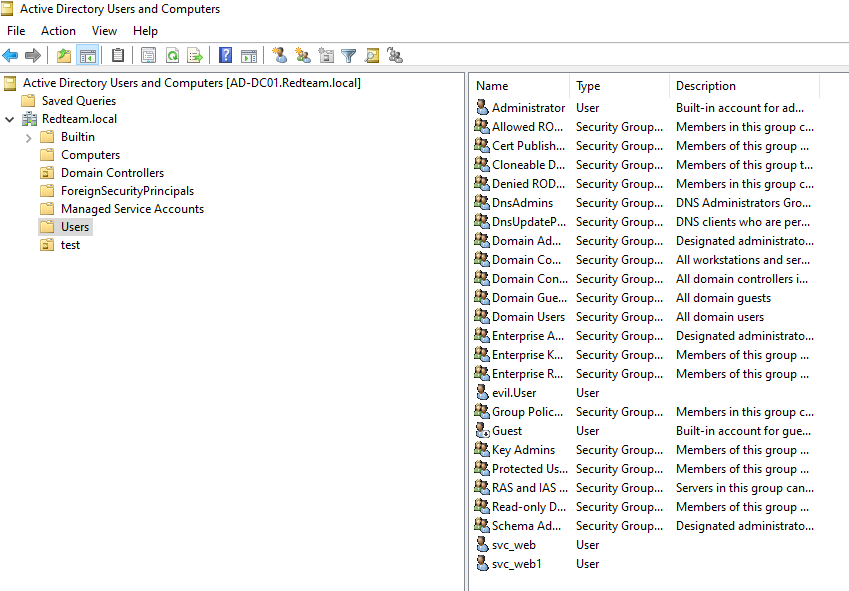
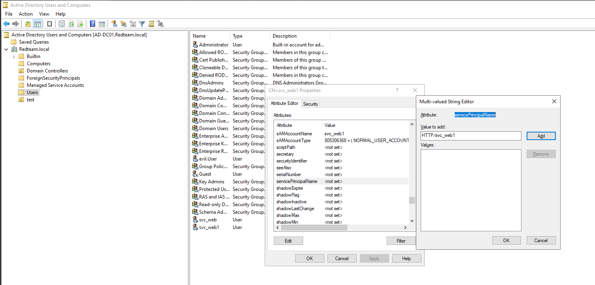

Kerberoasting (T1558.003) abuses the Kerberos protocol by allowing any authenticated domain user to request TGS tickets for accounts with SPNs registered. These tickets are encrypted with the service account's password hash and can be cracked offline. If the service account has a weak password, an attacker can obtain plaintext credentials without ever touching the target system.

**Lab Setup**
GUI:Open `dsa.msc` via Win + R, navigate to your domain FQDN → Users → Right-click → New → User. Create a name for the service account e.g. `svc_web1`  Then open `adsiedit.msc` via Win + R → Default Naming Context → DC=redteam, DC=local → Users → Right-click the created user → Properties → Attribute Editor → find `servicePrincipalName` → double-click → Add a value in the following format:

```
TYPE_OF_SERVICE/SERVICE_NAME.FQDN
```

Example:

```
MSSQLSvc/svc_web.redteam.local:1433
```


CLI: Create the Service Account
`New-ADUser -Name "web_svc" -SamAccountName "web_svc" -AccountPassword (ConvertTo-SecureString "Password123" -AsPlainText -Force) -PasswordNeverExpires $true -Enabled $true` 

Assign SPN 
`setspn -A HTTP/web_svc.redteam.local:80 redteam\web_svc`

Verify SPN
`setspn -L web_svc`


**The Attack**
From Linux.  `impacket-GetUserSPNs -dc-ip $IP redteam.local/$CONTROLLED_USER$:$PASSWORD$ -request`


From Windows. `.\Rubeus.exe kerberoast /nowrap`


**Detection**
Modify local_rules.xml in wazuh  to detect kerberoast.
```
<group name="windows,kerberos,attack">

  <rule id="100010" level="12">
    <if_sid>60103</if_sid>
    <field name="win.system.eventID">^4769$</field>
    <field name="win.eventdata.ticketEncryptionType">^0x17$</field>
    <description>Kerberoasting detected - RC4 TGS ticket requested</description>
    <mitre>
      <id>T1558.003</id>
    </mitre>
  </rule>

</group>
```

Explaining Each rule.
```
if_sid 60103 Windows Security Events
win.system.eventID 4769 Kerberos Service Ticket Request
win.data.ticketEncryptionType 0x17 Old-Legacy RC4 Encryption
level 12 High Severity Alert
T1558.003 MITRE ATT&CK technique ID for Kerberoasting
```

Wazuh capturing eventID 4769 Kerberos Service Ticket Request from `evil.user@REDTEAM.LOCAL` for service account `web_svc` using RC4 encryption (0x17), Indicating a Kerberoasting attempt.

**Remediations**

| Least Privilege                | When assigning SPNs, ensure the service account has the minimum permissions required to perform its function. Avoid assigning SPNs to privileged accounts.                                                      |
| ------------------------------ | --------------------------------------------------------------------------------------------------------------------------------------------------------------------------------------------------------------- |
| Strong Passwords               | Use a password manager to generate complex passwords of at least 25 characters, combining uppercase letters, digits and special characters. Length is the most important factor in preventing offline cracking. |
| Regular Rotation               | Rotate service account passwords regularly to limit the exposure in the event of a breach.                                                                                                                      |
| Group Managed Service Accounts | (gMSA) automatically rotate their passwords every 30 days with a 120 character machine-generated password, making them virtually impossible to crack.                                                                                                                                                                                                         |

